

[![LinkedIn][linkedin-shield]][linkedin-url]

<!-- PROJECT LOGO -->
 

    
  <h3 align="center">Invoicer - Client & Invoice Management App</h3>

<!-- TABLE OF CONTENTS -->

  
Table of Contents

  <ol>
    <li>
      <a href="#about-the-project">About The Project</a>
      <ul>
        <li><a href="#business-case">Business Case</a></li>
        <li><a href="#technical-solution">Technical Solution</a></li>
        <li><a href="#screenshots">Screenshots</a></li>
        <li><a href="#tech-stack">Tech Stack</a></li>
      </ul>
    </li>
    <li><a href="#contact">Contact</a></li>
  </ol>

<!-- ABOUT THE PROJECT -->
## About The Project

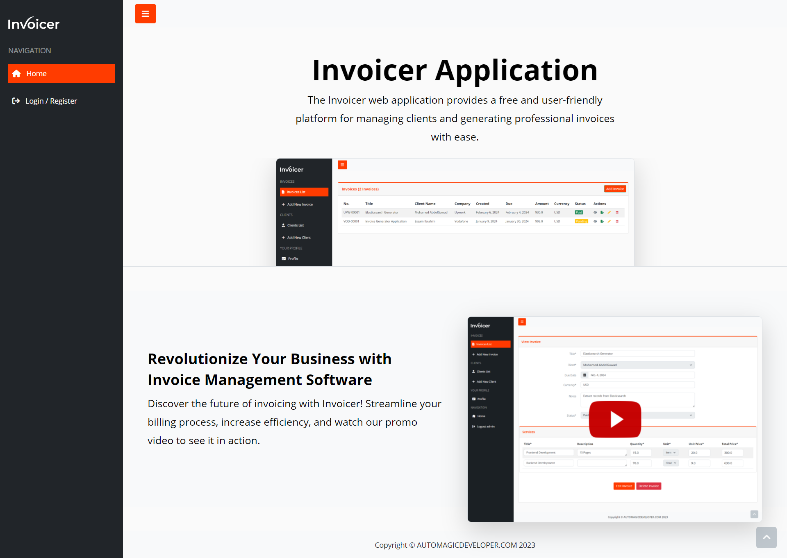

* **Project Name:** Invoicer - Client & Invoice Management App  
* **Version:** v1.0.0  

---

### Business Case

**Invoicer** is a streamlined invoicing solution designed to help freelancers and small businesses manage clients and invoices efficiently. Users can sign up, log in, and seamlessly create, manage, and print invoices. The app makes managing client information and invoices straightforward, minimizing time spent on administrative tasks.

The application was developed with flexibility in mind, featuring a dynamic invoicing interface with heavy JavaScript integration, allowing users to add items dynamically, calculate totals automatically, and apply discounts with ease.

(<a href="#readme-top">back to top</a>)

### Technical Solution

The project is hosted as a Django web application in a Docker Compose stack with Nginx, Postgres, and the app container itself. Additionally, Helm charts are available for easy deployment on Kubernetes clusters.

The solution includes:
* **Frontend**: Built with HTML, CSS, JavaScript, and Bootstrap for responsive design and enhanced user experience.
* **Backend**: Django framework, handling client and invoice management.
* **Dynamic Invoice Management**: JavaScript allows users to add items to invoices, calculate totals automatically, and save data seamlessly.
* **Discounts and Calculations**: Users can apply discounts, with the system calculating the total amounts in real-time.

**Containerization**: Deployed using Docker Compose with three containers:
* **App Container**: Hosts the Django application.
* **Postgres Database Container**: Manages data storage.
* **Nginx Proxy Server Container**: Manages routing and acts as a reverse proxy.

(<a href="#readme-top">back to top</a>)

### Screenshots

#### Login / Register
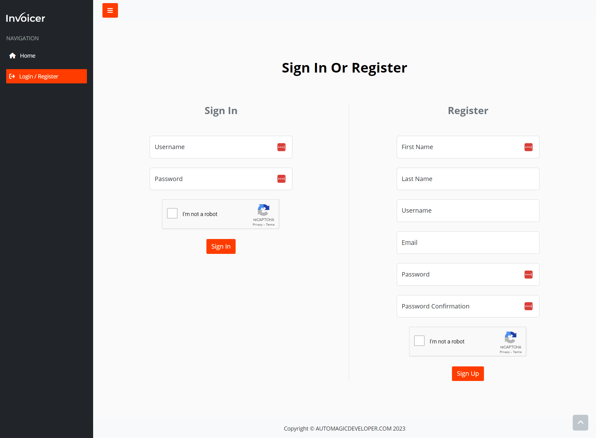

#### Homepage

#### Client Management
- **Add New Client**  
  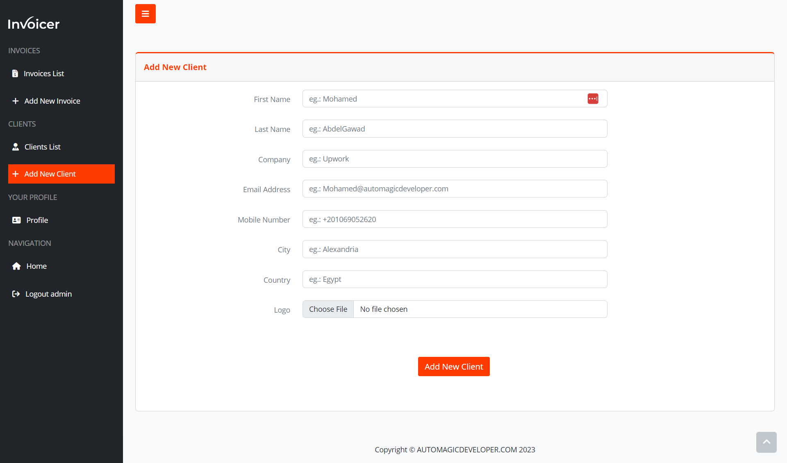
- **Edit Client**  
  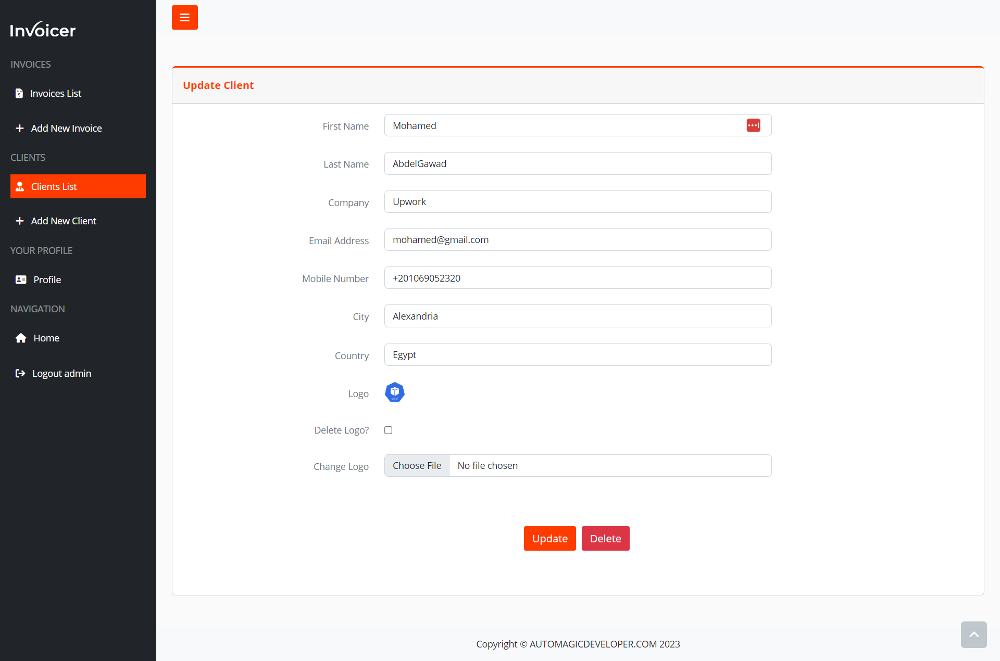
- **View Client**  
  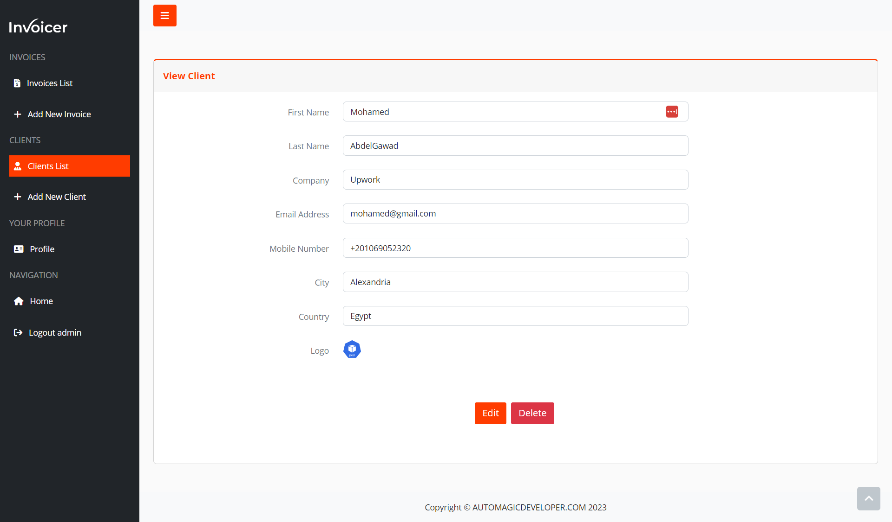
- **Clients List**  
  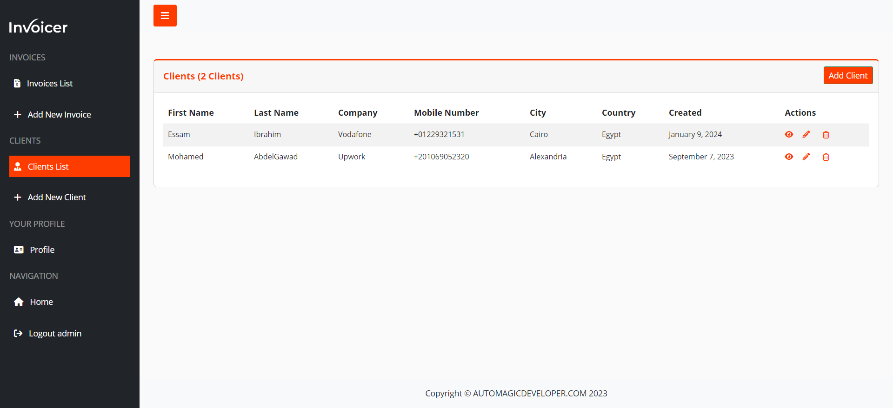
- **Delete Client**  
  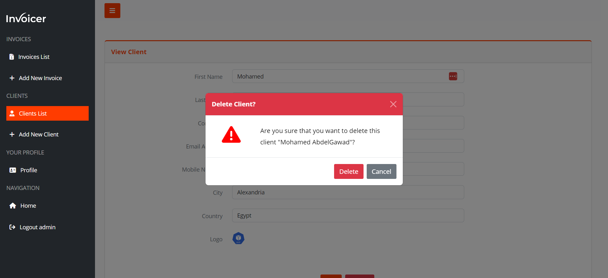

#### Invoice Management
- **Add New Invoice**  
  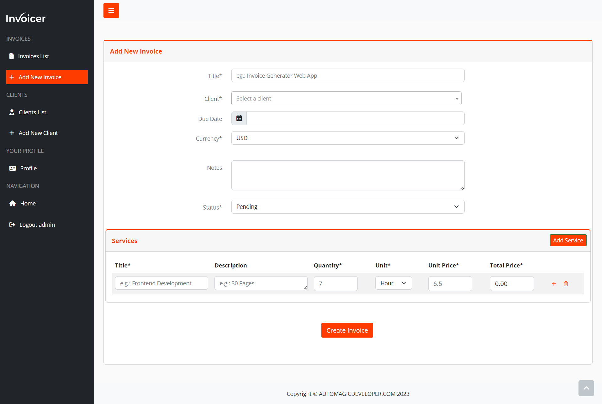
- **Edit Invoice**  
  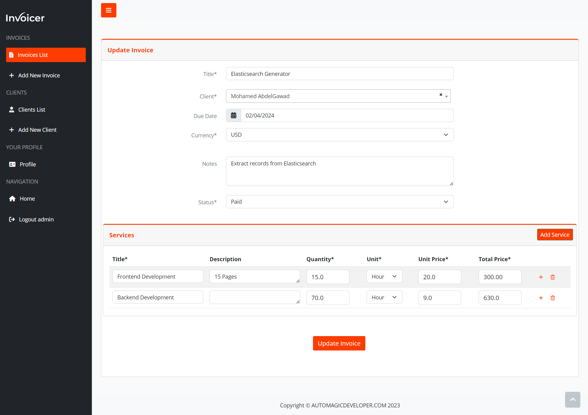
- **View Invoice**  
  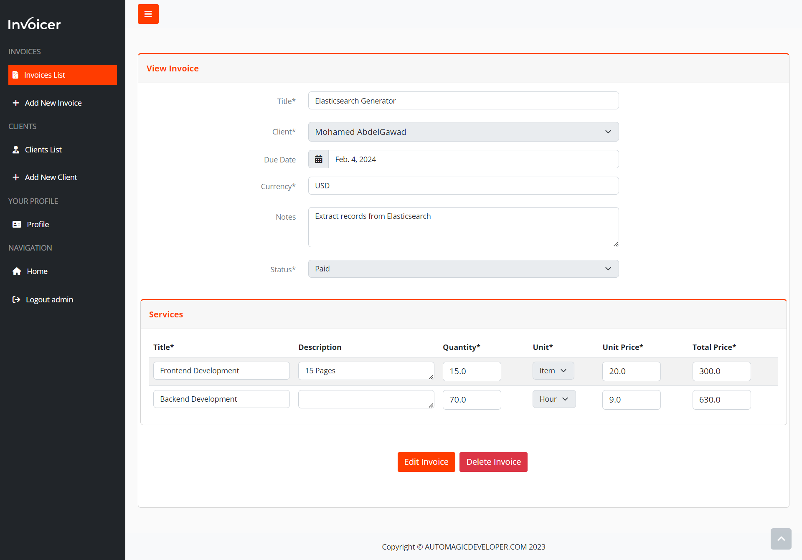
- **Invoices List**  
  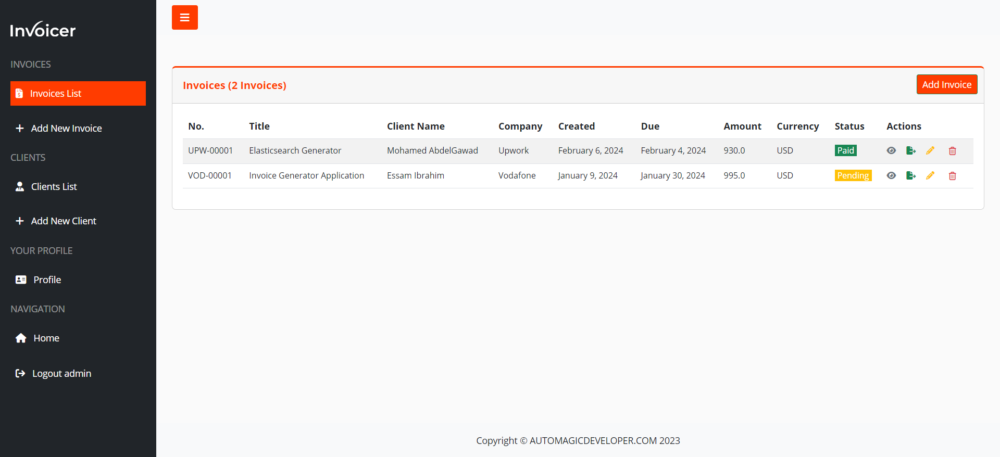
- **Delete Invoice**  
  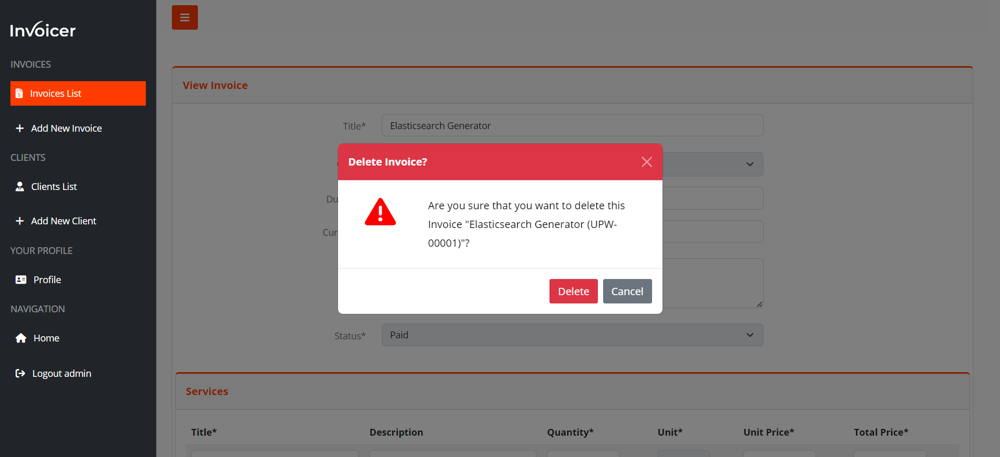
- **Export Invoice**  
  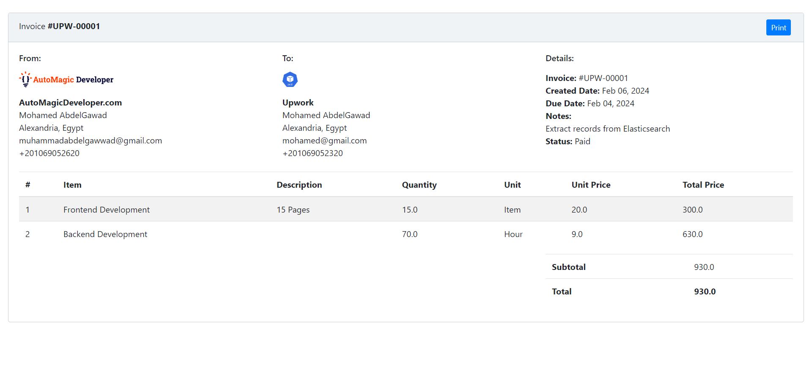

#### User Profile
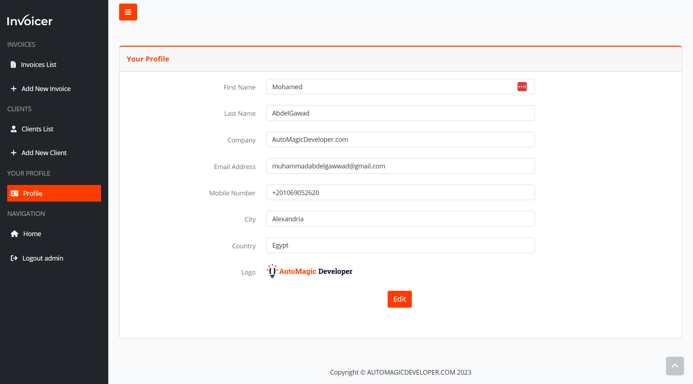

(<a href="#readme-top">back to top</a>)

### Tech Stack

This project was developed using the following tech stack:

* **Frontend**: HTML, CSS, JavaScript, Bootstrap
* **Backend**: Django
* **Database**: PostgreSQL
* **Containerization**: Docker, Docker Compose, Nginx
* **Orchestration**: Helm charts for Kubernetes deployment

(<a href="#readme-top">back to top</a>)

<!-- CONTACT -->
## Contact

Mohamed AbdelGawad Ibrahim - [@m-abdelgawad](https://www.linkedin.com/in/m-abdelgawad/) - <a href="tel:+201069052620">+201069052620</a>

(<a href="#readme-top">back to top</a>)

<!-- MARKDOWN LINKS & IMAGES -->
[linkedin-shield]: https://img.shields.io/badge/-LinkedIn-black.svg?style=for-the-badge&logo=linkedin&colorB=555
[linkedin-url]: https://www.linkedin.com/in/m-abdelgawad/
